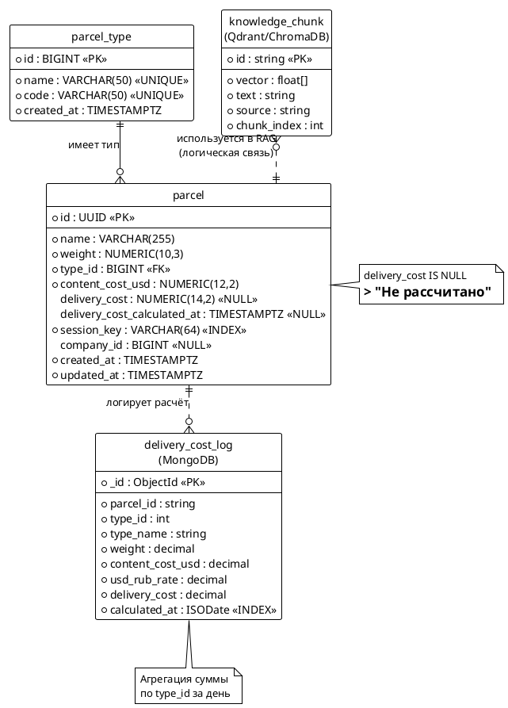

# Модель данных и ER-диаграмма — Микросервис доставки посылок


## СУБД

- **Основная БД:** PostgreSQL (рекомендуется) или MySQL.
- **Кеш:** Redis (курс валют).
- **Векторная БД:** Qdrant или ChromaDB (RAG).
- **Лог расчётов (доп.):** MongoDB.

---

## Сущности

### 1. `parcel_type` — Тип посылки

Справочник типов. Хранится в отдельной таблице (требование задания).

| Поле | Тип | Ограничения | Описание |
|------|-----|-------------|----------|
| `id` | BIGINT / SERIAL | PK, autoincrement | Идентификатор типа |
| `name` | VARCHAR(50) | UNIQUE, NOT NULL | Название типа (`одежда`, `электроника`, `разное`) |
| `code` | VARCHAR(50) | UNIQUE, NOT NULL | Машиночитаемый код (`clothes`, `electronics`, `misc`) |
| `created_at` | TIMESTAMPTZ | NOT NULL, default now() | Дата создания |

**Начальные данные (seed):**

| id | name | code |
|----|------|------|
| 1 | одежда | clothes |
| 2 | электроника | electronics |
| 3 | разное | misc |

---

### 2. `parcel` — Посылка

Основная сущность.

| Поле | Тип | Ограничения | Описание |
|------|-----|-------------|----------|
| `id` | UUID / BIGINT | PK | Идентификатор посылки |
| `name` | VARCHAR(255) | NOT NULL | Название посылки |
| `weight` | NUMERIC(10,3) | NOT NULL, CHECK > 0 | Вес в кг |
| `type_id` | BIGINT | FK → `parcel_type.id`, NOT NULL | Тип посылки |
| `content_cost_usd` | NUMERIC(12,2) | NOT NULL, CHECK >= 0 | Стоимость содержимого в USD |
| `delivery_cost` | NUMERIC(14,2) | NULL | Стоимость доставки в RUB (NULL = не рассчитано) |
| `delivery_cost_calculated_at` | TIMESTAMPTZ | NULL | Когда рассчитана стоимость |
| `session_key` | VARCHAR(64) | NOT NULL, INDEX | Ключ сессии владельца |
| `company_id` | BIGINT | NULL, CHECK > 0 | ID транспортной компании (доп. задание) |
| `created_at` | TIMESTAMPTZ | NOT NULL, default now() | Дата регистрации |
| `updated_at` | TIMESTAMPTZ | NOT NULL, auto | Дата обновления |

**Индексы:**
- `idx_parcel_session_key` — по `session_key` (выборка своих посылок).
- `idx_parcel_type_id` — по `type_id` (фильтр по типу).
- `idx_parcel_delivery_cost_null` — частичный индекс `WHERE delivery_cost IS NULL` (для периодической задачи).
- `idx_parcel_company_id` — по `company_id` (доп. задание).

**Бизнес-правила:**
- `delivery_cost IS NULL` → отображается «Не рассчитано».
- `company_id` заполняется только один раз (атомарно).

---

### 3. `delivery_cost_log` — Лог расчётов (доп. задание, MongoDB)

Коллекция в MongoDB для хранения истории расчётов.

| Поле | Тип | Описание |
|------|-----|----------|
| `_id` | ObjectId | Идентификатор записи |
| `parcel_id` | string | ID посылки |
| `type_id` | int | ID типа посылки |
| `type_name` | string | Название типа |
| `weight` | decimal | Вес |
| `content_cost_usd` | decimal | Стоимость содержимого |
| `usd_rub_rate` | decimal | Использованный курс |
| `delivery_cost` | decimal | Рассчитанная стоимость |
| `calculated_at` | ISODate | Дата расчёта |

**Индексы:**
- `{ calculated_at: 1, type_id: 1 }` — для агрегации по дням и типам.

**Пример агрегации (сумма по типам за день):**

```javascript
db.delivery_cost_log.aggregate([
  { $match: { calculated_at: { $gte: ISODate("2026-09-28T00:00:00Z"),
                               $lt:  ISODate("2026-09-29T00:00:00Z") } } },
  { $group: { _id: "$type_id", type_name: { $first: "$type_name" },
              total: { $sum: "$delivery_cost" } } },
  { $sort: { _id: 1 } }
])
```

---

### 4. `knowledge_chunk` — Фрагмент базы знаний (векторная БД)

Хранится в Qdrant/ChromaDB.

| Поле | Тип | Описание |
|------|-----|----------|
| `id` | string / UUID | Идентификатор фрагмента |
| `vector` | float[] | Вектор эмбеддинга |
| `text` | string | Текст фрагмента (payload) |
| `source` | string | Имя исходного файла базы знаний |
| `chunk_index` | int | Порядковый номер фрагмента |

---

## ER-диаграмма (PlantUML)



---

## DDL (PostgreSQL)

```sql
CREATE TABLE parcel_type (
    id          BIGSERIAL PRIMARY KEY,
    name        VARCHAR(50) NOT NULL UNIQUE,
    code        VARCHAR(50) NOT NULL UNIQUE,
    created_at  TIMESTAMPTZ NOT NULL DEFAULT now()
);

CREATE TABLE parcel (
    id                          UUID PRIMARY KEY DEFAULT gen_random_uuid(),
    name                        VARCHAR(255) NOT NULL,
    weight                      NUMERIC(10,3) NOT NULL CHECK (weight > 0),
    type_id                     BIGINT NOT NULL REFERENCES parcel_type(id),
    content_cost_usd            NUMERIC(12,2) NOT NULL CHECK (content_cost_usd >= 0),
    delivery_cost               NUMERIC(14,2),
    delivery_cost_calculated_at TIMESTAMPTZ,
    session_key                 VARCHAR(64) NOT NULL,
    company_id                  BIGINT CHECK (company_id > 0),
    created_at                  TIMESTAMPTZ NOT NULL DEFAULT now(),
    updated_at                  TIMESTAMPTZ NOT NULL DEFAULT now()
);

CREATE INDEX idx_parcel_session_key ON parcel (session_key);
CREATE INDEX idx_parcel_type_id ON parcel (type_id);
CREATE INDEX idx_parcel_company_id ON parcel (company_id);
CREATE INDEX idx_parcel_delivery_cost_null ON parcel (id) WHERE delivery_cost IS NULL;

INSERT INTO parcel_type (name, code) VALUES
    ('одежда', 'clothes'),
    ('электроника', 'electronics'),
    ('разное', 'misc');
```

---

## Связи

| Связь | Тип | Описание |
|-------|-----|----------|
| `parcel_type` → `parcel` | 1 : N | Один тип у многих посылок |
| `parcel` → `delivery_cost_log` | 1 : N | Одна посылка — много записей лога (логическая, разные БД) |
| `knowledge_chunk` → RAG | — | Используется при обработке вопроса, не связана с посылками напрямую |