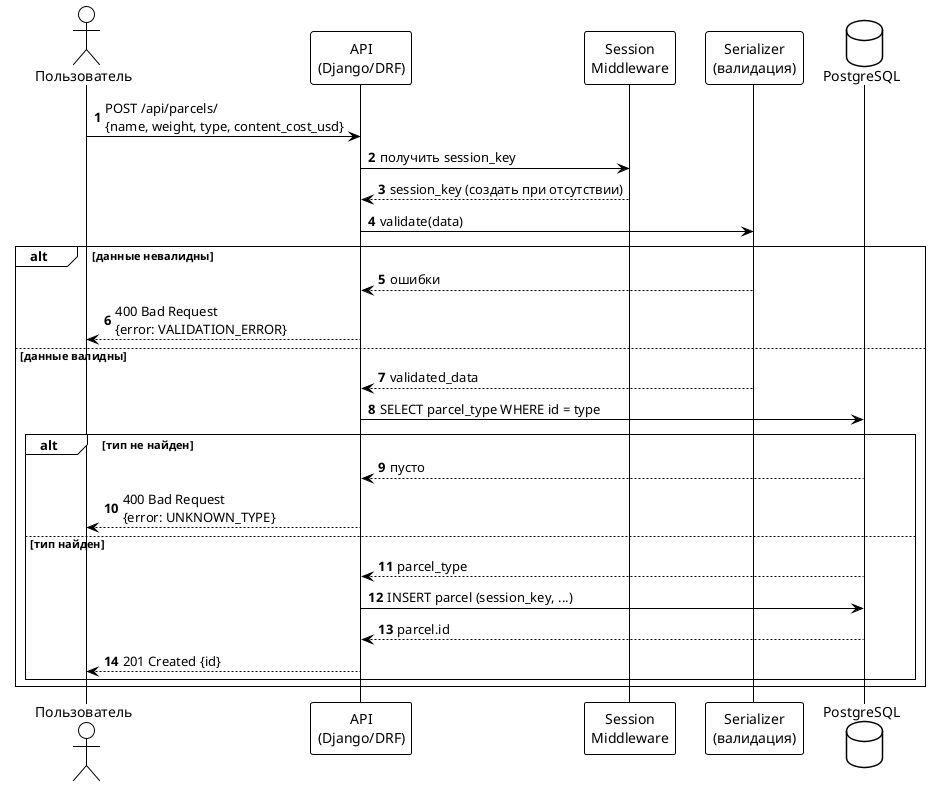
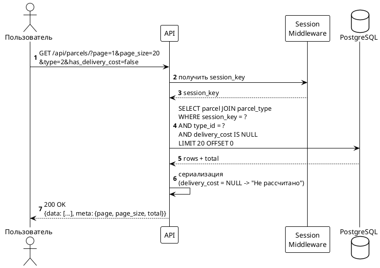
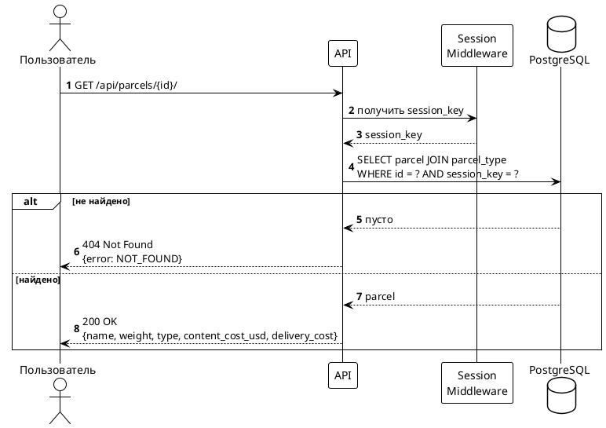
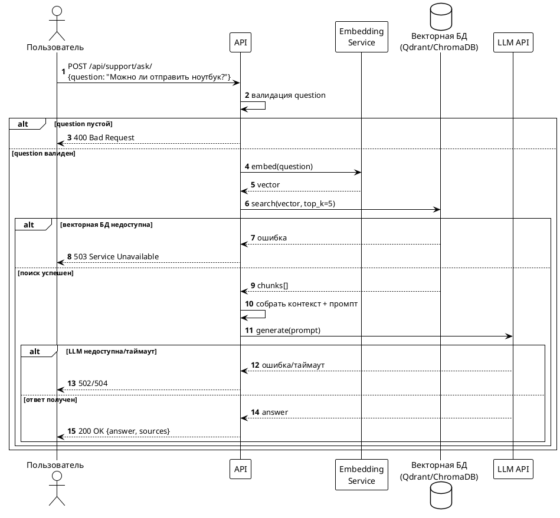
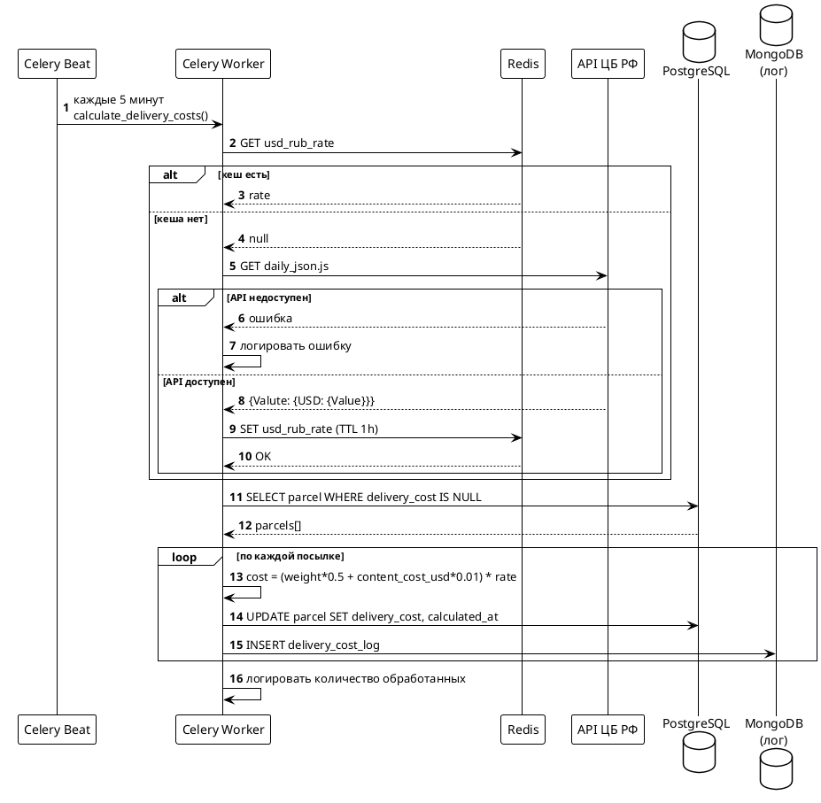
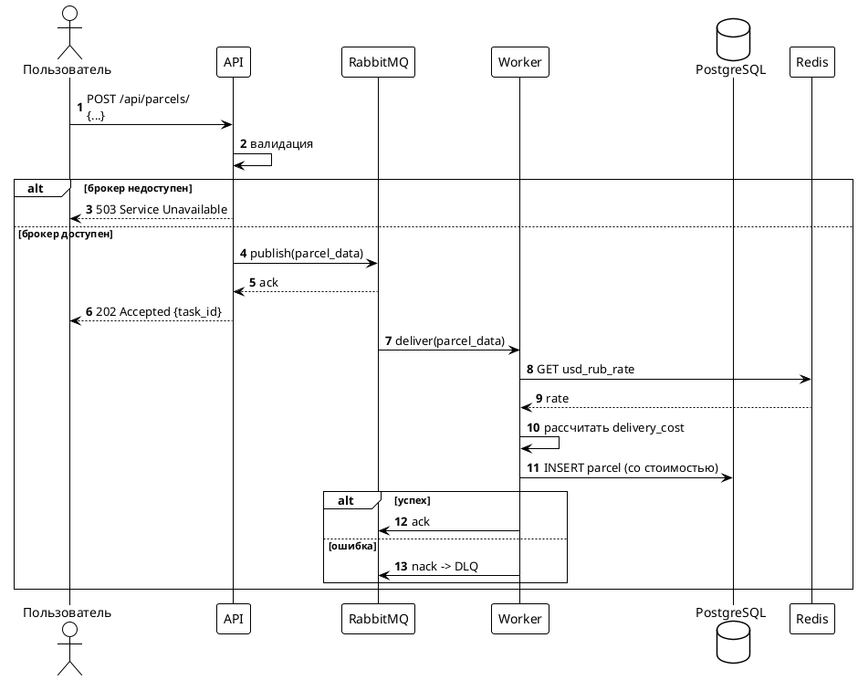

# Sequence-диаграммы — Микросервис доставки посылок


## SEQ-01. Регистрация посылки



---

## SEQ-02. Получение списка своих посылок



---

## SEQ-03. Получение данных о посылке по id



---

## SEQ-04. RAG-вопрос службе поддержки



---

## SEQ-05. Периодический расчёт стоимости доставки



---

## SEQ-06. Привязка посылки к транспортной компании (доп.)

```plantuml
@startuml
!theme plain
autonumber

actor "Компания A" as A
actor "Компания B" as B
participant "API" as API
database "PostgreSQL" as DB

par A -> API : POST /api/parcels/{id}/assign/\n{company_id: 1}
and B -> API : POST /api/parcels/{id}/assign/\n{company_id: 2}
end

API -> DB : UPDATE parcel\nSET company_id = ?\nWHERE id = ? AND company_id IS NULL

alt Компания A успела первой
    DB --> API : updated = 1 (A)
    API --> A : 200 OK
    DB --> API : updated = 0 (B)
    API --> B : 409 Conflict\n{current_company_id: 1}
else Компания B успела первой
    DB --> API : updated = 1 (B)
    API --> B : 200 OK
    DB --> API : updated = 0 (A)
    API --> A : 409 Conflict\n{current_company_id: 2}
end

@enduml
```

---

## SEQ-07. Регистрация посылки через RabbitMQ (доп.)



---

## SEQ-08. Подсчёт суммы стоимостей по типам за день (доп.)

```plantuml
@startuml
!theme plain
autonumber

actor "Аналитик" as A
participant "API" as API
database "MongoDB" as MDB

A -> API : GET /api/reports/delivery-costs/?date=2026-09-28
API -> MDB : aggregate([\n  {$match: {calculated_at: день}},\n  {$group: {_id: "$type_id", total: {$sum: "$delivery_cost"}}}\n])
MDB --> API : [{type_id, total}, ...]
API --> A : 200 OK {report: [...]}

@enduml